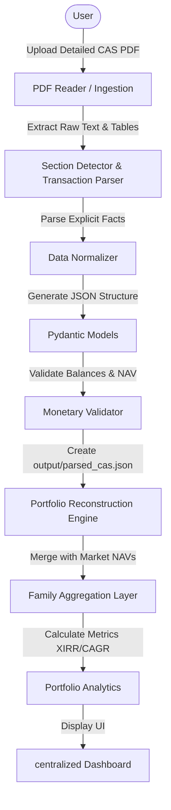

# WealthNest

A centralized family mutual fund portfolio management and analytics platform.

---

## Problem: Family Mutual-Fund Fragmentation

While platforms like MF Central do a fantastic job consolidating mutual fund records around a single individual investor account (linked by PAN), there is currently no simple, unified view for family-level investments. 

In a typical household, investments are distributed across several family members:
- **Father’s portfolio** (separate folios, AMCs, platforms)
- **Mother’s portfolio** (separate folios, AMCs, platforms)
- **Brother’s portfolio**
- **My portfolio**

To understand the household’s consolidated asset allocation, risk profile, and overall net worth, families are forced to manually stitch data together using spreadsheets or log into multiple separate accounts.

---

## Why WealthNest?

WealthNest bridges this gap. It acts as a **family-level aggregation and analytics layer** built on top of user-provided data.

> [!IMPORTANT]
> **WealthNest is NOT a replacement for MF Central.**
> MF Central remains the authoritative legal record source for individual portfolios. WealthNest simply aggregates that raw data at the household level to provide holistic family portfolio calculations and visualizations.

---

## Tech Stack
- **Core Engine**: Python >= 3.11
- **PDF Extraction**: PyMuPDF (fitz), pdfplumber
- **Data Validation & Schemas**: Pydantic v2
- **Unit Testing**: pytest
- **Output Formats**: Normalized JSON

---

## Architecture

The project's architectural pipeline is designed to be purely deterministic for all financial and validation calculations.



---

## Core Features

### ✅ Implemented
- **CAS PDF parsing**: Extraction of structured transaction data using PyMuPDF & pdfplumber.
- **Statement Metadata**: Automatically extracts statement period (`period_start`, `period_end`) and the generation date.
- **Folio Segmentation**: Splits transactions by distinct AMC folio numbers to ensure clean bookkeeping.
- **Fact-Only Ingestion**: Extracted SIP data (e.g. `32/136`) is populated directly from text. No future SIP schedule inference is guessed during parsing.
- **System Event Silencing**: Silent filtration of bank mandate changes, KYC updates, etc., avoiding unparsed transaction clutter.
- **Reversal Processing**: Maps bounce/reversal records (`REVERSAL` type) using accounting parentheses conversion (e.g., `(999.95)` becomes `-999.95`).
- **Monetary NAV Validation**: Validates transactions using monetary arithmetic: `abs(Amount - (Units * NAV)) <= 0.50 INR`.
- **Portfolio Summary & Import Preview**: Summarizes detected funds, folios, and transaction classifications inside the output JSON.

### 🚧 In Progress
- **Portfolio Reconstruction Engine**: Transitioning raw, normalized transactions into state-tracked holdings, calculating cumulative invested amounts, and processing redemptions, switches, and reversals.

### ⬜ Planned
- **NAV API Integration**: Fetching real-time and historical NAVs via public feeds (e.g. MFapi.in) to evaluate current portfolio valuation.
- **Family Portfolio Aggregator**: Creating family groups, assigning member ownership to folios, and calculating household asset allocation.
- **Interactive UI Dashboard**: Rendering charts, timelines, asset allocation splits, and member-specific performance overviews.
- **Security & Multi-user Auth**: Role-based access control, secure document processing, and encryption-at-rest strategies.

---

## Validation & Rounding

We run a strict monetary validation routine on every parsed transaction:

$$\text{Monetary Difference} = | \text{Amount} - (\text{Units} \times \text{NAV}) | \le 0.50\text{ INR}$$

### Rounding Warnings
CAS documents print unit balances truncated to 3 decimal places. At a high NAV (e.g., > ₹1,500), losing just `0.0005` units creates a minor, expected display difference of up to ₹0.75 in the calculated amount. WealthNest surfaces these validation warnings transparently instead of silently altering raw data or blindly increasing tolerances to hide them.

---

## Data Model

- **Family**: Group container linking multiple members.
- **FamilyMember**: Tracks individual identity and portfolio ownership.
- **Folio**: Tracks distinct AMC folios, registrars (CAMS/KFintech), and opening/closing balances.
- **Transaction**: Tracks individual records (Date, Type, Subtype, Amount, Units, NAV, Unit Balance).
- **Holding (Derived)**: Real-time holdings state tracking calculated units and valuations.

---

## Current Test Results

The ingestion parser is fully tested against two detailed CAS reports:

### CAS_01
- **Transactions Parsed**: 129
- **Purchases**: 129
- **Reversals**: 0
- **Validation Warnings**: 0

### CAS_02
- **Transactions Parsed**: 73
- **Purchases**: 71
- **Reversals**: 2
- **Validation Warnings**: 7 (All isolated to high-NAV 3-decimal unit roundings, validated under ₹0.50 monetary threshold).

---

## Ingestion Pipeline Workflow

1. **PDF Extract**: Reads raw lines page-by-page.
2. **Segment**: `SectionDetector` isolates individual folios.
3. **Classify**: `TransactionClassifier` labels transactions (Purchase, Reversal, Stamp Duty, Switch).
4. **Normalize**: `TransactionParser` cleans dates, decimals, and negative parentheses.
5. **Validate**: `Validator` checks unit balance totals and NAV.

---

## Project Structure

```
WealthNest/
├── cas-parser/
│   ├── app/
│   │   ├── models/           # Pydantic Schemas (Folio, Statement, Transaction)
│   │   ├── parser/           # Extraction logic, Classifier, Validator
│   │   └── main.py           # CLI Parser Orchestrator
│   ├── output/               # Git-ignored JSON output folder
│   └── requirements.txt      # Parser-specific dependencies
├── docs/
│   └── phases/               # Phase roadmap tracking files
├── tests/                    # Ingestion test suite
├── pyproject.toml            # Project-level dependencies
├── CHANGELOG.md              # Milestones
├── ROADMAP.md                # Phase-tracker
├── CONTRIBUTING.md           # Developer guidelines
├── SECURITY.md               # Safety guidelines on CAS PDFs
└── README.md                 # Main overview
```

---

## Security Warning

> [!CAUTION]
> CAS PDFs contain sensitive personal identification (PAN) and financial balances. **Never commit real CAS PDFs or unanonymized JSON outputs to the repository.** Ensure all test fixtures are thoroughly sanitized.
